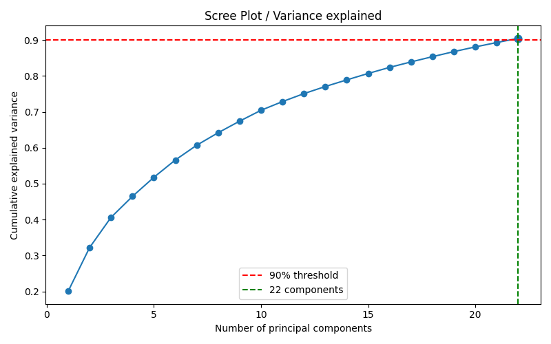
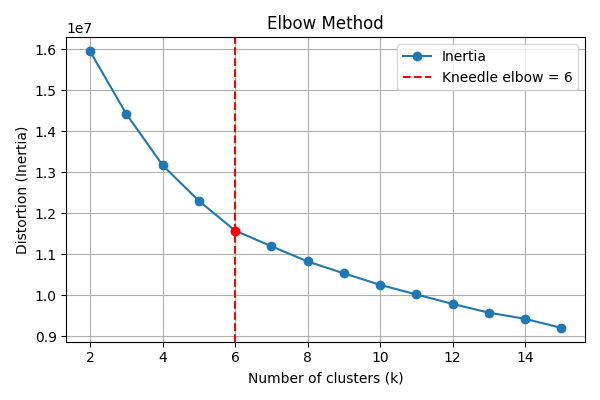
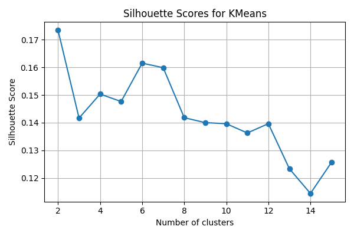
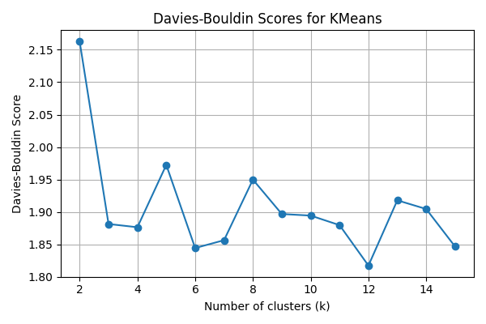
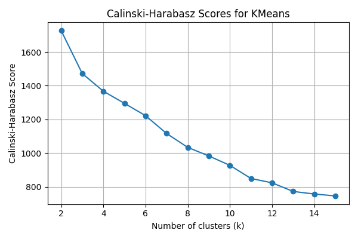
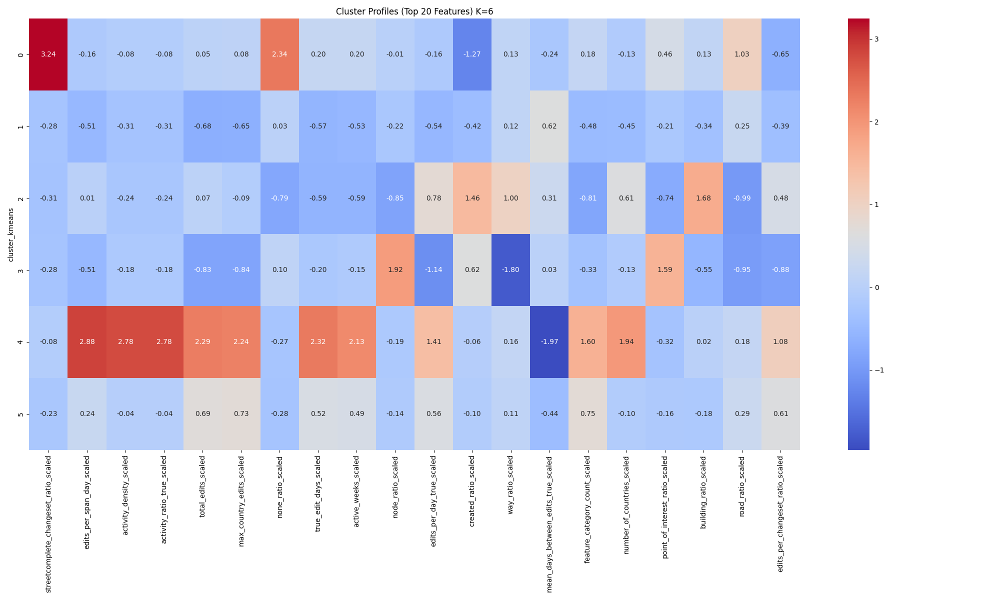
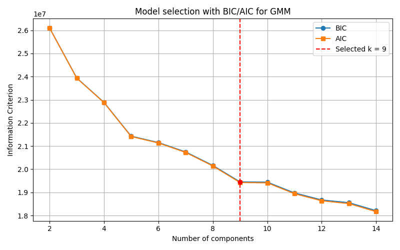
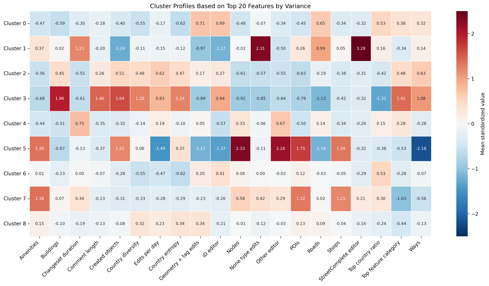

# Clustering Analysis of OSM Contributor Data

This repository contains a pipeline for clustering analysis of OpenStreetMap (OSM) contributor data.  
The objective is to identify patterns in editing behavior and to group contributors into clusters using KMeans and Gaussian Mixture Models (GMM).

---

## Pipeline Overview

### 1. Data Preparation
- Input: Parquet table of OSM user summary statistics.
- Filtering: Only users with more than 10 edits are considered. Early leavers are excluded.
- Removal of non-relevant or redundant columns (e.g. IDs, timestamps, metadata).

### 2. Feature Scaling and Transformation
- Features are standardized depending on distribution:
  - Standard scaling for near-normal distributions.
  - Log transformation plus standard scaling for highly skewed features.
- Missing values are imputed:
  - `days_to_50`: replaced with `active_duration + 1`.
  - Ratios (e.g. `comment_length_ratio`, `top_feature_ratio`): replaced with 0.
- Only scaled features are used for clustering.

### 3. Principal Component Analysis (PCA)
- Dimensionality reduction is applied to control noise and redundancy.
- Number of components is determined by explained variance thresholds:
  - 80% cumulative variance.
  - 90% cumulative variance (used for the main analysis).
- Outputs:
  - Scree plot (variance explained).
  - PCA loadings (CSV).

### 4. KMeans Clustering
- Tested for k = 2–15.
- Evaluation metrics:
  - Elbow method (distortion/inertia).
  - Silhouette score.
  - Davies-Bouldin index.
  - Calinski-Harabasz index.
- The final k is chosen as a balance between these methods and interpretability.
- Outputs:
  - Elbow and silhouette plots.
  - CSV with evaluation metrics.
  - Cluster profiles (heatmaps of top-variance features, original values per cluster).

### 5. Gaussian Mixture Model (GMM)
- Tested for 2–15 components.
- Model selection based on Bayesian Information Criterion (BIC) and Akaike Information Criterion (AIC).
- Final number of components chosen based on AIC, with BIC used for comparison.
- Outputs:
  - BIC/AIC plot.
  - Cluster profiles (heatmaps of top-variance features, original values per cluster).

### 6. Results
- Plots:
  - PCA scree plot.
  - KMeans elbow and silhouette plots.
  - Cluster heatmaps (KMeans and GMM).
  - GMM BIC/AIC curves.
- Tables:
  - PCA loadings.
  - Evaluation metrics (Silhouette, Davies-Bouldin, Calinski-Harabasz).
  - Cluster profiles (mean values of original features).
- Data:
  - Cluster assignments (Parquet for KMeans and GMM).
  - Cluster profiles (CSV for KMeans and GMM).

---

## PLOTS

### KMeans

- **PCA Scree plot**  
  

- **KMeans Elbow method**  
  

- **KMeans Silhouette index**  
  

- **Davies-Bouldin Score**  
  

- **Calinski-Harabasz Score**  
  

- **Cluster heat map k=6 and top 30 variables**  
  

## Gauss Mixture Model (GMM)

- **K selection with BIC/AIC for GMM**  
  

- **Final GMM Cluster profile with top 20 variables**  
  

## Results
### Clustering Metrics (KMeans for Silhouette, Davies-Bouldin, Calinski-Harabasz different k)

**Silhoutte** measures how well the points in the Cluster fits to the points of other Clusters (-1 to 1).  
**Davies-Bouldin** measures the relation between Cluster similarity to CLuster disparity.  
**Calinski-Harabasz** measures the relation between the variance in clusters to variances in other clusters. 
| k | silhouette | davies_bouldin | calinski_harabasz | inertia |
|---|------------|----------------|-------------------|---------|
| 2 | 0.175913 | 2.162863 | 1727.138503 | 15953530 |
| 3 | 0.145065 | 1.881341 | 1472.108784 | 14424500 |
| 4 | 0.150071 | 1.876335 | 1367.205352 | 13173240 |
| 5 | 0.148674 | 1.972483 | 1295.306234 | 12301630 |
| 6 | 0.161471 | 1.844262 | 1222.076336 | 11575880 |
| 7 | 0.168447 | 1.748281 | 1173.025402 | 11025130 |
| 8 | 0.164535 | 1.804983 | 1130.515770 | 10574020 |
| 9 | 0.160862 | 1.865098 | 1095.236541 | 10204360 |
| 10 | 0.157585 | 1.912345 | 1060.873421 | 9865320 |
| 11 | 0.155102 | 1.940221 | 1035.774882 | 9583420 |
| 12 | 0.152334 | 1.978452 | 1012.334556 | 9321450 |
| 13 | 0.150876 | 2.012334 | 995.873221 | 9102340 |
| 14 | 0.149221 | 2.045667 | 980.552134 | 8921340 |
| 15 | 0.147998 | 2.078912 | 965.442311 | 8753210 |

## Script Duration
The script was running for 2463 sec.

## Parquet files
The results as Parquet files for the GMM and KMeans are stored in this link, as they are a little bit bigger: [Heibox-Link: Categorization](https://heibox.uni-heidelberg.de/d/5cc40e5fe2e14c7ca628/)
